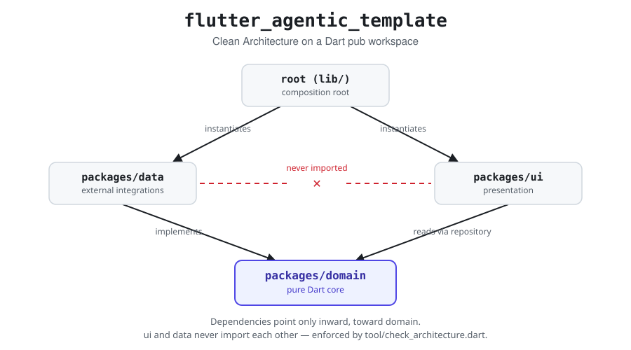

# Flutter Agentic Template

[](https://github.com/alfredobs97/flutter_agentic_template/actions/workflows/ci.yml)
[](LICENSE)
[](.fvmrc)
[](https://github.com/alfredobs97/flutter_agentic_template/generate)


A **Clean Architecture Flutter template on a Dart pub workspace** — a plain
Flutter starting point on its own, additionally pre-wired for **Claude
Code**, **OpenAI Codex**, **Google Antigravity** and **OpenCode** (plus
`AGENTS.md`/skill support for **Pi**) for teams that want an AI agent to
extend it. Not a sample app to delete parts of, but documented, working
infrastructure you build a real feature on top of, either way.

- `flutter_bloc` for state management (Cubit/BLoC, no `setState` in a
  feature screen).
- `go_router` with typed routes and a router-*building function*, never a
  memoized singleton.
- Sealed `DomainFailure` failures, mapped at the data-provider boundary — no
  raw exception ever reaches a widget.
- Zero pre-installed persistence/network stack — `packages/data` starts
  empty on purpose; you choose Drift, Firebase, Supabase, Dio, or whatever
  else your app needs.

## 📖 Contents

- [Two ways to use this template](#two-ways-to-use-this-template)
- [Documentation map](#documentation-map)
- [Video series & write-ups](#video-series--write-ups)
- [Quick start](#quick-start)
- [Architecture at a glance](#architecture-at-a-glance)
- [Working with AI agents](#working-with-ai-agents)
- [Commands](#commands)
- [Why an empty skeleton](#why-an-empty-skeleton)
- [License](#license)

<a id="two-ways-to-use-this-template"></a>
## 🧭 Two ways to use this template

- **Plain Flutter.** Clone it, bootstrap it, and build features by
  following `AGENTS.md` (the project's conventions guide — see
  [`docs/without-ai.md`](docs/without-ai.md) for what to ignore and how to
  use the skill docs as plain recipes). The `ai/`, `.agents/`, `.claude/`,
  `.codex/` folders and `.mcp.json` sit at the repo root but nothing in
  them runs unless an AI tool reads them; ignore them entirely if you
  don't use one.
- **With an AI agent.** Open the repo in Claude Code, Codex, Antigravity, or
  OpenCode — each reads `AGENTS.md` natively and already has the matching
  skills/subagents/MCP servers configured. No extra setup step. Pi also
  reads `AGENTS.md` and the skills natively (run `pi --approve` once per
  clone to trust the project), but this template has no subagents for it —
  see [`ai/README.md`](ai/README.md)'s harness-support table.

Both paths bootstrap and build the same way; only the last mile (who
writes the code) differs. See the documentation map below for where to go
next depending on which path you're on.

<a id="documentation-map"></a>
## 🗺 Documentation map

| I want to... | Read | Audience |
|---|---|---|
| Get the app running for the first time | [`docs/getting-started.md`](docs/getting-started.md) | Everyone |
| Understand the architecture and the reasoning behind it | [`docs/architecture.md`](docs/architecture.md), [`docs/adr/`](docs/adr) | Everyone |
| Learn the project's conventions (layers, DI, error handling, routing, i18n...) | [`AGENTS.md`](AGENTS.md) | Everyone — despite the name, this is the team's style guide, not just an AI prompt |
| Build without an AI agent — what to ignore, how to use the skill docs as recipes | [`docs/without-ai.md`](docs/without-ai.md) | Flutter developers not using an AI agent |
| Use the skills/subagents/review protocol day to day, per tool | [`docs/ai-workflow.md`](docs/ai-workflow.md) | Developers using an AI agent |
| Change how the AI tooling itself is configured | [`ai/README.md`](ai/README.md) | Maintainers of the AI config |

<a id="video-series--write-ups"></a>
## 📺 Video series & write-ups

If you want the reasoning behind a decision, not just the code that
implements it, this template (and its companion app, "Brew Beans") is
built and explained step by step in two places:

- **YouTube**: [playlist](https://www.youtube.com/playlist?list=PLMX9_4O7e4fE) — watch the architecture and each convention get built up on screen.
- **Medium**: [@alfredobs97](https://medium.com/@alfredobs97) — the same reasoning in written form, for a deeper read on the "why" behind a specific choice.

<a id="quick-start"></a>
## ⚡ Quick start

1. Use this repository as a GitHub template (**Use this template** button)
   or `git clone` it.
2. Install the pinned Flutter SDK via [FVM](https://fvm.app/) (see
   `flutter-fvm` in `docs/ai-workflow.md`'s tool table, or just run these two
   commands):
   ```
   dart pub global activate fvm
   fvm install
   ```
3. Rename the package, bundle identifiers and app name away from the
   template defaults — either ask your AI agent to run the
   `bootstrap-project` skill, or work through
   [`docs/getting-started.md`](docs/getting-started.md#2-rename-the-project)
   yourself; the first, automatable half is:
   ```
   fvm dart run tool/rename_project.dart --name your_app_name
   ```
4. Fetch dependencies from the repo root (this is a pub *workspace* — the
   normal entry point is the root, though running `pub get` inside a single
   package under `packages/` also resolves correctly if you only touched
   that package's dependencies):
   ```
   fvm flutter pub get
   ```
5. Confirm everything is green:
   ```
   fvm dart run tool/quality_gate.dart
   ```

For the full step-by-step (including running the app itself, without an AI
agent) see [`docs/getting-started.md`](docs/getting-started.md).

<a id="architecture-at-a-glance"></a>
## 🏛️ Architecture at a glance

A root app (the composition root) plus three local packages, dependencies
pointing only inward toward `domain`:

<picture>
  <source media="(prefers-color-scheme: dark)" srcset="docs/assets/architecture-banner-dark.svg">
  
</picture>

```
lib/            composition root — the only place `data` and `ui` are both imported
packages/domain/  pure Dart: entities, data-provider interfaces, concrete repositories, sealed failures
packages/data/    external integrations: implements domain's data-provider interfaces, zero stack pre-installed
packages/ui/      presentation: screens, Cubits/BLoCs, theming, routing, l10n — never imports `data`
```

No repository-interface-plus-use-case layer, no `get_it`/service locator, no
`Either`/`Result` type — see [`docs/architecture.md`](docs/architecture.md)
for the full picture and the reasoning behind each of those choices, and
[`docs/adr/`](docs/adr) for the individual decision records.

<a id="working-with-ai-agents"></a>
## 🤖 Working with AI agents

Every tool in this template's roster reads **`AGENTS.md`** (root, plus each
`packages/*/AGENTS.md`) as its source of project rules. There is nothing
tool-specific to install for the rules themselves — only for the
subagents/skills layered on top:

- **Claude Code** reads `AGENTS.md` natively. Subagents live in
  `.claude/agents/`, skills in `.claude/skills/` (mirroring
  `.agents/skills/`) — both generated, see `ai/README.md`.
  **Do not add a `CLAUDE.md` or `CLAUDE.local.md` at the repo root** — either
  one makes Claude Code stop reading `AGENTS.md` automatically, silently
  dropping every rule in this document. The only exception: if you're on a
  setup where native `AGENTS.md` loading isn't available (some third-party
  model providers routed through Claude Code), add a **one-line**
  `CLAUDE.md` containing just `@AGENTS.md` to re-import it — nothing more.
- **OpenAI Codex** reads `AGENTS.md` natively. Its agents live in
  `.codex/agents/*.toml`, config in `.codex/config.toml` — generated.
- **Google Antigravity** reads `AGENTS.md` natively. Its agents live in
  `.agents/agents/*.md`, workflows in `.agents/workflows/*.md` — generated.
- **OpenCode** reads `AGENTS.md` natively. Its agents and MCP/formatter
  config live in `.opencode/agents/*.md` and `opencode.jsonc` — generated.
- **Pi** reads `AGENTS.md` natively from the repo root down (it does not
  walk into `packages/*/` on its own — see root `AGENTS.md` section 1) and
  skills from `.agents/skills/` once the project is trusted. It has no
  subagent or MCP concept, so nothing under `ai/agents/` or `ai/mcp.yaml`
  targets it; its one piece of config, `.pi/extensions/dart-format.ts`
  (format-on-edit), is hand-written rather than generated.

All read the *same* `AGENTS.md` (itself hand-authored, not generated) and
the same per-tool config, generated from the *same* `ai/` source (see
[`docs/ai-workflow.md`](docs/ai-workflow.md) for how a request flows
through skills and subagents in practice, including a per-tool quick
reference and copy-paste starter prompts). Never hand-edit a generated
file — edit `ai/` or `.agents/skills/` and run
`fvm dart run tool/sync_ai_config.dart` (see [`ai/README.md`](ai/README.md)
for exactly which paths are source and which are generated).

This template ships 17 skills (bootstrapping, choosing a data stack, one
per layer of a feature, testing, error handling, code review, ...) and 8
subagents (an architect, a feature implementer, a UI implementer from
Figma, a test writer, two blind code reviewers, a review-fixer, and a
quality gate). The full list, with what each one does and when it's
triggered, lives in [`docs/ai-workflow.md`](docs/ai-workflow.md) rather than
duplicated here.

<a id="commands"></a>
## 🛠 Commands

Always run these through `fvm` (see the `flutter-fvm` skill) or `dart run`:

| Task | Command |
|---|---|
| Get dependencies | `fvm flutter pub get` (run at the repo root — this is a pub workspace) |
| Format | `fvm dart format -l 100 .` |
| Analyze | `fvm flutter analyze --fatal-infos` |
| Regenerate l10n | `fvm flutter gen-l10n` (from `packages/ui/`) |
| Run every check | `fvm dart run tool/quality_gate.dart` |
| Check architecture boundaries only | `fvm dart run tool/check_architecture.dart` |
| Run all tests | `fvm flutter test` (root), `fvm dart test` (in `packages/domain`), `fvm flutter test` (in `packages/data`, `packages/ui`) |
| Check AI config is in sync | `fvm dart run tool/sync_ai_config.dart --check` |

<a id="why-an-empty-skeleton"></a>
## 🧱 Why an empty skeleton

This template deliberately ships **no sample feature**. What it ships
instead is documented, commented infrastructure: a composition root that
explains what to add and where, a flavor system that already works, a
theme, a router, localization wired end to end, and a `home` screen that is
real working navigation-shell infrastructure — not a to-do-list demo
standing in for "your first feature." The result is that nothing has to be
found and deleted before real work starts, and an AI agent reading the repo
for the first time sees only patterns that are meant to be imitated.

<a id="license"></a>
## 📄 License

MIT — see [`LICENSE`](LICENSE).
