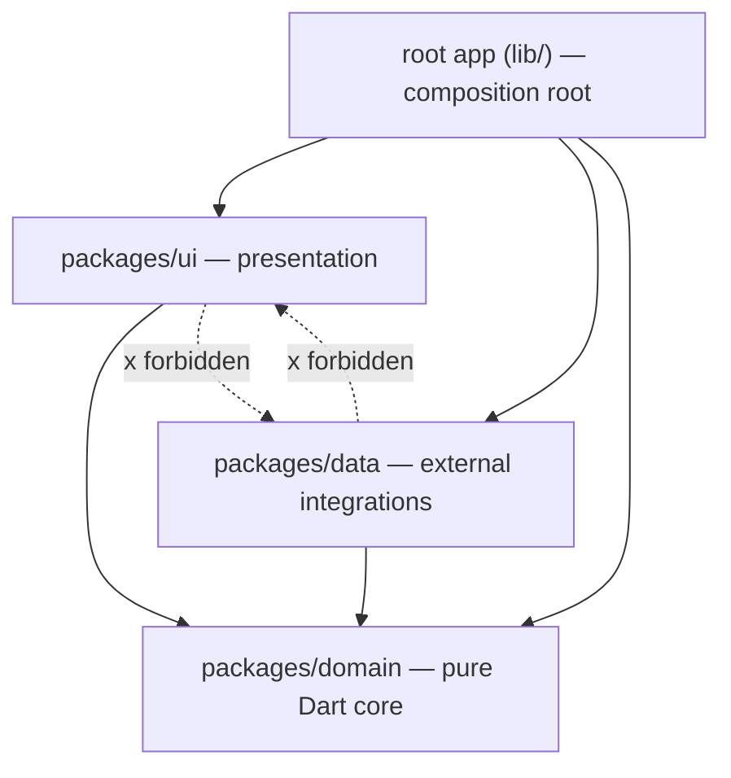

# Architecture

This is the deep-dive companion to the README's "Architecture at a glance"
section. It covers the shape of the workspace and, more importantly, *why*
each structural decision was made the way it was — the individual decision
records live in [`docs/adr/`](adr), this page ties them together.

## Layer dependency direction

Everything points inward, toward `domain`. `root` is the **only** package
allowed to import both `data` and `ui` — it is the composition root
(`lib/bootstrap.dart`), where every concrete repository is built once and
handed down through `RepositoryProvider`. `ui` and `data` never see each
other: if a screen needs data, it goes through a `domain` repository
injected into a Cubit/BLoC, never a data provider directly.

This isn't just convention — it's enforced twice:

1. **Structurally**: `packages/ui/pubspec.yaml` has no dependency on
   `data`. Adding one accidentally is a hard `pub get`/compile error the
   moment an import is written, not a lint that can be silenced.
2. **Mechanically**: `tool/check_architecture.dart` (part of
   `tool/quality_gate.dart`) walks every import in the workspace and
   rejects a `flutter`/`dart:io` import in `domain`, a `data` import in
   `ui`, and any relative import that reaches into another package's
   `src/` — see `AGENTS.md` section 13.

## Pub workspace, not Melos

The repo root, `packages/domain`, `packages/data` and `packages/ui` are a
single **Dart pub workspace** (`workspace:` in the root `pubspec.yaml`,
`resolution: workspace` in each package's own `pubspec.yaml`) — a feature
native to Dart 3.5+, not a third-party tool. `fvm flutter pub get` run once
at the repo root resolves all four `pubspec.yaml` files together, with a
single `pubspec.lock` and a single shared `.dart_tool/`.

The alternative most Flutter monorepos reach for is
[Melos](https://melos.invertase.dev/): a separate CLI, its own config file,
its own command surface (`melos bootstrap`, `melos run ...`) layered on top
of pub. For a three-package workspace with no publishing pipeline and no
need for independent versioning, that's an extra tool to install, pin, and
teach an AI agent about, for a problem native workspaces already solve.
Pub workspaces have a narrower feature set than Melos (no independent
package versioning/publishing orchestration, no scripts DSL) — this
template doesn't need either, so it takes the smaller surface. See
[ADR 0001](adr/0001-pub-workspaces.md).

## Concrete repositories, not repository-interfaces + use cases

A very common Clean Architecture shape in Flutter is: an abstract
`XRepository` interface in `domain`, a concrete `XRepositoryImpl` in `data`,
and a `UseCase` class per operation that a Cubit/BLoC calls instead of the
repository directly. This template uses none of that. Instead (`AGENTS.md`
section 1):

- **Data-provider interfaces** (`abstract interface class`, in terms of
  entities only) live in `domain`, implemented in `data`. This is the one
  seam that stays abstract — it's what lets a data provider be faked in a
  repository test.
- **Repositories are concrete classes that live entirely in `domain`**,
  constructor-injected with one or more data-provider interfaces. A
  repository holds the orchestration a use-case class would otherwise hold
  (combining two providers, applying a rule before persisting) — there is
  no separate use-case layer on top of it.

The reasoning is tracing distance: with an interface-plus-impl-plus-use-case
shape, answering "what actually happens when this button is pressed"
means following Cubit → use case → repository interface → repository impl
→ data provider interface → data provider impl — six hops, several of them
pure pass-through. With a concrete repository, it's Cubit → repository →
data-provider interface → data-provider impl — four hops, and every one of
them does something. That shorter chain matters as much for an AI agent
reading the codebase cold as it does for a human; fewer indirection layers
means fewer places a hallucinated abstraction can be inserted, and fewer
files to open to verify a change is correct. See
[ADR 0002](adr/0002-concrete-repositories.md).

## Sealed `DomainFailure`, not `Either`/`Result`

Error handling uses a `sealed class DomainFailure`
(`packages/domain/lib/src/failures/domain_failure.dart`) with five
subtypes, thrown/returned at the data-provider boundary via
`guard`/`guardStream` and a package-specific `FailureMapper`
(`packages/data/lib/src/guards/failure_guard.dart`) — never an
`Either<Failure, T>` or a `Result<T>` wrapper type. Two reasons:

1. **No functional-programming dependency.** `Either` needs a package
   (`fpdart`, `dartz`, ...) and asks every contributor — human or AI agent
   — to be fluent in `.fold`/`.map`/`.flatMap` chains before they can read
   an error path at all. A `sealed` hierarchy is exhaustively
   switch-checked by the Dart analyzer itself (a `switch` missing a
   `DomainFailure` subtype is a compile error), which is the actual
   type-safety guarantee `Either` is usually reached for — without the
   extra vocabulary.
2. **Cubits/BLoCs stay idiomatic Dart.** A `try`/`catch` around a
   repository call, mapping the caught `DomainFailure` to a UI-error value
   in `emit`, reads the same as any other Dart error handling — no
   unwrapping a monadic return value first.

See [ADR 0003](adr/0003-sealed-domain-failure.md), and
`.agents/skills/error-handling/SKILL.md` for when a new `DomainFailure`
subtype is actually warranted (rare — prefer the five that exist).

## Manual DI via `RepositoryProvider`, not `get_it`

Every repository is instantiated exactly once in `lib/bootstrap.dart` and
exposed to the widget tree via `RepositoryProvider`/`MultiRepositoryProvider`
in `lib/app.dart` — constructor injection, wired at one call site. No
`get_it`, no `injectable`, no other service locator (`AGENTS.md` section 20
forbids it outright).

The reasoning is the same "one place to see the whole graph" argument as
the repository decision above: a service locator resolves a dependency at
the call site, by type, at runtime — which means the *only* way to know
what `MyRepository` actually needs, or whether it's registered at all, is
to run the app and see if it crashes, or grep for every `registerLazySingleton`
call site. With manual DI, `lib/bootstrap.dart` **is** the dependency
graph — every repository, in the order it's built, with its constructor
arguments visible in the same file. That file is also the one and only
place in the codebase that imports both `data` and `ui`, which makes it
the natural place to keep this. See
[ADR 0004](adr/0004-manual-di.md).

## Flavors

Two build flavors, `dev` and `prod`, driven by two flags that must always
agree: the native `--flavor <dev|prod>` (selects the Android
`productFlavor` / iOS scheme via `ios/Flutter/*-dev.xcconfig` /
`*-prod.xcconfig`) and `--dart-define=FLAVOR=<dev|prod>` (read at runtime
by `AppEnvironment.flavor` in `lib/app_environment.dart`). The
`.vscode/launch.json` configurations set both together so nobody has to
remember to keep them in sync by hand — see `AGENTS.md` section 14 and the
`flavors-and-flags` skill for adding a per-flavor `FeatureFlag` default in
`lib/feature_flag_defaults.dart`.

## `packages/data` is data-stack-agnostic

`packages/data/pubspec.yaml` depends on `domain` and `uuid` — nothing else.
There is no Drift, no Dio, no Firebase SDK pre-installed, and no data
provider implementation checked in. This is deliberate: the template
doesn't assume every app needs the same backend, and picking a stack is a
decision the developer (or their AI agent, running
`.agents/skills/choose-data-stack/SKILL.md`) makes once, explicitly, for
their app — rather than inheriting a stack from the template and having to
rip it out. Once a stack is chosen, the skill adds the dependency, a
stack-specific `FailureMapper`, a provider skeleton, and a test harness.
See [ADR 0007](adr/0007-data-stack-agnostic.md).
